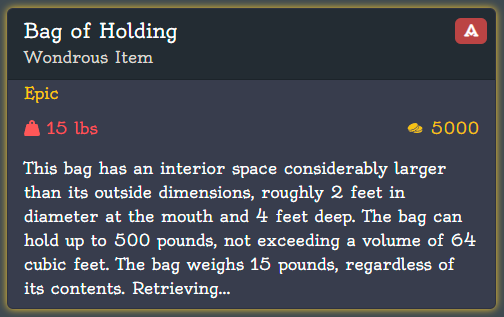
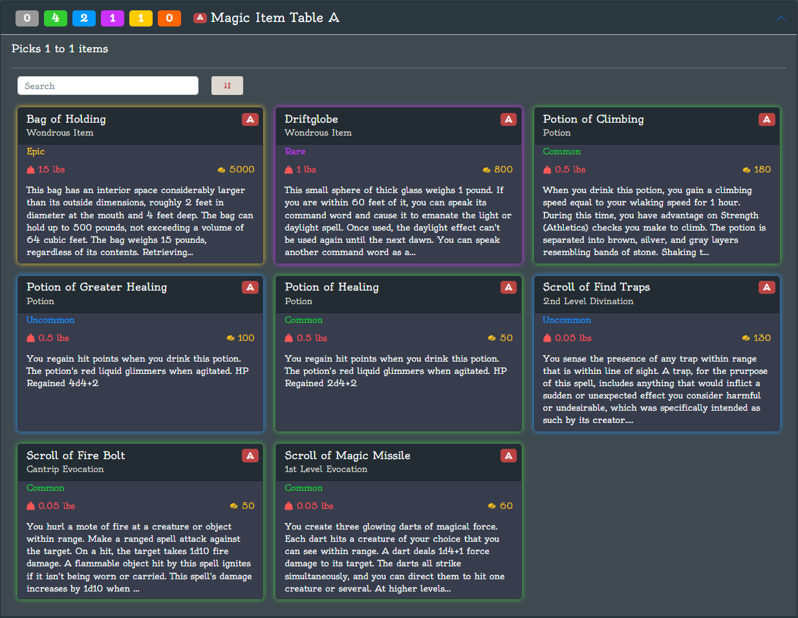

# Introduction

Welcome, Game Masters and Players, to Alderman RPG – the definitive toolkit for tabletop RPGs. Alderman RPG is designed to offer a range of free tools that seamlessly enhance your adventures.

Key features:
- Roll for Loot & Treasure
- Create and manage custom Loot & Loot Tables
- Share your Loot & Loot Tables with others

# Concepts

## Loot

Loot refers to the virtual items, treasures, or rewards that players can obtain, create, manage, and share within the game. These can range from weapons and armor to magical artifacts and gold, enhancing the depth and excitement of gameplay.

*D&D 5e Example*

> **Bag of Holding**
>
> *Wondrous item, uncommon*
>
> This bag has an interior space considerably larger
than its outside dimensions, roughly 2 feet in diameter
at the mouth and 4 feet deep. The bag can hold up to
500 pounds, not exceeding a volume of 64 cubic feet.
The bag weighs 15 pounds, regardless of its contents.
Retrieving an item from the bag requires an action.
>
> ...

*Alderman RPG Example*

## Loot Tables

A Loot Table is a predefined list or set of Loot from which the game system randomly selects when determining what loot players receive. This allows for variability and surprise in the items players might obtain during their adventures.

*D&D 5e Example*

> Magic Item Table A
> 
> | d100 | Magic Item |
> |------|------------|
> | 01-50 | Potion of Healing |
> | 51-60 | Spell scroll (cantrip) |
> | 61-70 | Potion of climbing |
> | 71-90 | Spell scroll (1st level) |
> | 91-94 | Spell scroll (2nd level) |
> | 95-98 | Potion of greater healing |
> | 99 | Bag of holding |
> | 00 | Driftglobe |

*Alderman RPG Example*

# Step-by-Step Instructions

## Registering an Account

Some features require a registered account. To register a new account, navigate to `Login` in the top right corner.

In the login prompt, navigate to `Create an account`.

Enter your `email`, `password`, and `confirm you password`.

Select `Create Account`.

## Roll for Loot & Treasure

Rolling for Loot is an exciting experience and very easy in Alderman RPG.

To roll loot, navigate to home page by selecting `Play` in the upper left corner. This will show the `Roll for Loot & Treasure` block.

Select the dropdown menu `Select Loot Table` and select a loot table to roll from. There are predefined tables you can choose from.

With a Loot Table selected, click `Roll`. Behold your loot!

If you would like to customize your Loot or Loot Tables see sections [Manage Loot](#Manage-Loot) and [Manage Loot Tables](#Manage-Loot-Tables)

## Manage Loot

In Alderman RPG you can manage, create, and customize Loot.

To manage Loot, navigate to `Manage > Loot` in the top navigation bar.

To view Loot details, select the Loot block.

If you want to customize existing Loot, select the `...` symbol in the upper right of the Loot block to bring up the action menu. Select `Edit Loot` to bring up the edit page.

If you want to delete existing Loot, select the `...` symbol in the upper right of the Loot block to bring up the action menu. Select `Delete Loot` to bring up the edit page.

If you want to create new Loot, select `Create Loot` in the upper right of the page.

If the Loot has a red and white Alderman A next to the name then this is predefined system Loot and cannot be modified.

## Manage Loot Tables

In Alderman RPG you can manage, create, and customize Loot Tables.

To manage Loot, navigate to `Manage > Loot Tables` in the top navigation bar.

To view Loot Table details, select the drown arrow of the Loot Table.

If you want to customize existing Loot Tables, expand the Loot Table, select the `...` symbol in the upper right of the Loot Table block to bring up the action menu. Select `Edit Loot Table` to bring up the edit page.

If you want to delete an existing Loot Tables, expand the Loot Table, select the `...` symbol in the upper right of the Loot Table block to bring up the action menu. Select `Delete Loot Table` to bring up the edit page.

If you want to create new Loot Table, select `Create Loot Table` in the upper right of the page.

If the Loot Table has a red and white Alderman A next to the name then this is predefined system Loot and cannot be modified.

# FAQs

## How is rolling Loot calculated?

details coming soon

# Contact/Support Information

If you have any issues or need support please contact us at support@aldermanrpg.com

If you have any feedback or comments you can fill out our [survey](https://docs.google.com/forms/d/e/1FAIpQLSfI5ce9LxDmKg9LrroBnIeBQ7KXteqAZoaXide-nX0LPYuZgg/viewform?usp:sf_link)

You can find our feature roadmap and future planning on our [trello board](https://trello.com/b/v8tttbl7/alderman-app-roadmap)